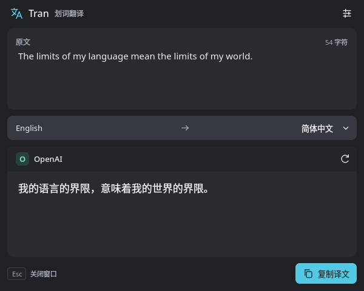
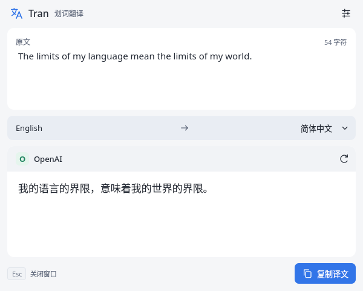
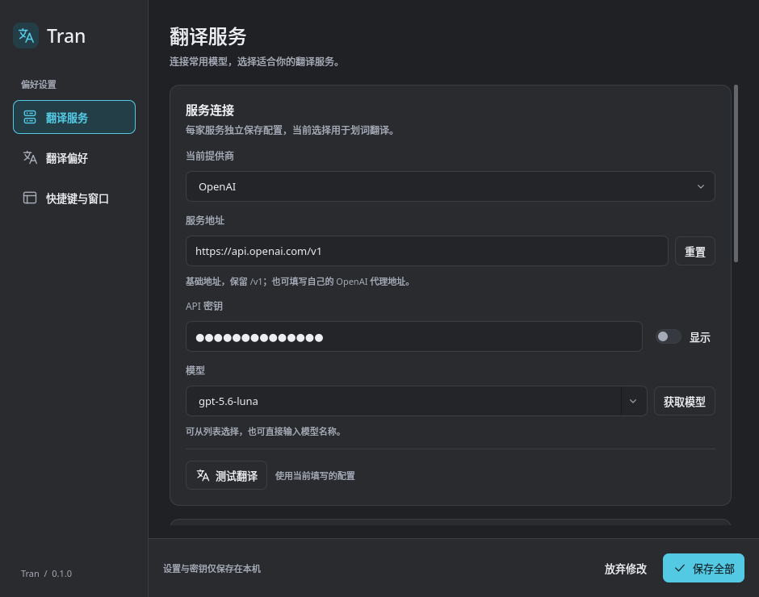

# Tran

Tran 是一款常驻系统托盘的选区翻译工具。在浏览器、编辑器或终端中选中一个词或一段话，按 **Meta+Shift+T**，即可在弹窗中查看译文。

支持 OpenAI 和 DeepSeek，配色跟随系统深浅主题。需要自行配置可用的 API 密钥，翻译费用由所选服务计收。

| 深色翻译窗口 | 浅色翻译窗口 |
| --- | --- |
|  |  |



## 系统要求

- **Arch Linux，x86_64 架构，KDE Plasma 6 的 X11 会话**。
- 能连接所选翻译服务的网络，以及对应服务的 API 密钥。
- 当前不支持 Wayland 选区读取、图片 OCR 或翻译历史。

可以在终端执行 `echo "$XDG_SESSION_TYPE"` 检查会话类型；选区翻译需要输出 `x11`。

## 安装

打开本仓库 GitHub 页面的 **Releases**，下载同一版本的 `tran-版本-1-x86_64.pkg.tar.zst` 和 `SHA256SUMS`，放到同一目录。安装包使用最新 Arch 依赖构建，请先完整更新系统，再进入下载目录校验并安装，例如：

```sh
sudo pacman -Syu
sha256sum --check SHA256SUMS
sudo pacman -U ./tran-0.1.0-1-x86_64.pkg.tar.zst
```

将示例文件名替换为实际下载的版本。`pacman` 会安装 Qt/KDE 等运行依赖，同时安装 Tran 的程序、图标和应用入口，**无需 conda 或自行编译**。

安装后，从 KDE 应用启动器搜索 **Tran** 并打开，也可以执行 `tran`。如界面中文显示为方框，安装中文字体：

```sh
sudo pacman -S --needed noto-fonts-cjk
```

## 首次配置

首次启动会打开设置窗口：

1. 在 **翻译服务** 中选择 OpenAI 或 DeepSeek，填写 API 密钥和基础地址。
2. 选择账户可用的模型。可以点击 **获取模型**，也可以直接输入模型 ID。
3. 点击 **测试翻译** 验证配置，再点击底部 **保存全部**。
4. 关闭设置窗口，在其他应用中选中文字，按 **Meta+Shift+T** 翻译。Meta 通常是键盘上的 Windows 键。

| 服务 | 默认基础地址 | 默认模型 | API 模式 |
| --- | --- | --- | --- |
| OpenAI | `https://api.openai.com/v1` | `gpt-5.6-luna` | Responses；可切换 Chat Completions |
| DeepSeek | `https://api.deepseek.com` | `deepseek-flash` | Chat Completions |

默认模型只是预设，实际可用性以账户和服务端为准。使用代理服务时，请填写其基础地址并选择支持的 API 模式；程序会自动追加接口路径，地址中不要包含 `/responses`、`/chat/completions` 或 `/models`。

**测试翻译会发送一次正常计费的请求**，使用页面中当前填写的配置；测试成功不会自动保存，仍需点击“保存全部”。OpenAI 和 DeepSeek 的配置分别保留，当前选中的服务用于后续翻译。

默认自动识别原文并翻译为简体中文。翻译窗口随原文和译文自动调整大小，长文本在窗口内滚动，无需手动配置尺寸。在 **翻译偏好** 中可以修改语言、提示词和超时；在 **快捷键与窗口** 中可以修改快捷键、窗口位置和字号。设置窗口的各页共用“保存全部”，关闭窗口会放弃未保存的修改。

## 日常使用

| 操作 | 效果 |
| --- | --- |
| 选中文字后按 **Meta+Shift+T** | 翻译当前选区，无需先复制 |
| 托盘菜单 → **翻译选中文本** | 翻译当前选区 |
| **Esc** 或关闭翻译窗口 | 收起窗口；正在进行的请求会被取消 |
| 点击托盘图标，或菜单 → **打开翻译窗口** | 查看上次原文和译文，不重新请求接口、不额外消耗 token |
| **复制译文** | 将译文放入剪贴板 |
| **重新翻译** | 重新请求翻译，会按服务规则计费 |
| 托盘菜单 → **设置…**，或翻译窗设置图标 | 修改服务、翻译和窗口设置 |
| 托盘菜单 → **退出 Tran** | 完全退出程序 |

关闭窗口后 Tran 仍在托盘运行。上次翻译若被取消，再次打开窗口也不会自动重试；需要手动点击“重新翻译”。连续触发快捷键时，窗口只显示最新请求的结果。

修改快捷键时，点击“录制”后按包含 Ctrl、Alt 或 Meta 的组合；Esc 取消录制。“清空”可禁用快捷键，“恢复默认快捷键”可还原。若与其他应用冲突，保存时会提示，可换一个组合。

需要开机登录后运行时，在 KDE 系统设置的 **自动启动** 中添加 Tran。

## 配置与隐私

配置默认保存在 `~/.config/tran/settings.ini`；设置了 `XDG_CONFIG_HOME` 时使用对应目录。**API 密钥以明文保存在本地配置文件中，不与系统密钥库交互**。配置目录权限为 `0700`，文件权限为 `0600`；分享或备份配置时请留意其中的密钥。

最近一次原文和译文只保留在内存中，关闭窗口不清除，退出程序后清除，不写入磁盘。触发翻译时，原文会发送给所选的 API 服务。程序只在触发选区翻译时读取选中文字；除“复制译文”外，不修改普通剪贴板。

## 常见问题

### 快捷键没有读取到文字

先确认当前使用 **Plasma X11** 会话，并在原应用中选中了可复制的文字。Wayland 选区读取暂不支持；图片或扫描版 PDF 需要 OCR，目前也不支持。若设置页提示快捷键冲突，请在“快捷键与窗口”中重新录制并保存。

### 翻译提示模型或接口错误

在设置中确认密钥、基础地址、模型和 API 模式，再点击“测试翻译”。默认模型可能不在当前账户的可用范围内，可用“获取模型”选择其他模型。较旧模型不支持推理参数时，将推理级别改为“服务默认”；连接较慢时可在“翻译偏好”中增加超时。

### 出现 `Failed to register with host portal` 提示

若后面包含 `App info not found for 'io.github.tran.Tran'`，通常表示桌面服务没有找到 Tran 的应用入口，常见于直接运行未安装的构建产物。这通常是一条桌面集成警告。通过上述安装包安装会一并提供 `.desktop` 文件；安装后从托盘退出旧实例，再从 KDE 启动器打开。

### 更新后仍然是旧版本

从 Releases 下载新版本并校验，先执行 `sudo pacman -Syu` 完整更新系统，再使用 `sudo pacman -U ./新版本文件.pkg.tar.zst` 安装，然后从托盘 **退出 Tran** 并重新打开。重复启动会转交给已有进程，不会替换正在运行的旧版本。

如果之前手动安装过 Tran，执行 `type -a tran` 检查路径。系统包安装在 `/usr/bin/tran`，`~/.local/bin/tran` 可能优先于它；可以直接运行 `/usr/bin/tran` 确认使用系统包版本。

### 如何卸载

先从托盘退出，然后执行：

```sh
sudo pacman -R tran
```

卸载保留用户配置。若希望同时清除密钥和设置，可在文件管理器中删除 `~/.config/tran`（设置了 `XDG_CONFIG_HOME` 时删除其下的 `tran` 目录）。

## 开发与参考

构建、测试、架构及 GitHub 自动发布说明见 [开发与维护指南](docs/development.md)。界面参考 [Pot Desktop](https://github.com/pot-app/pot-desktop)。
